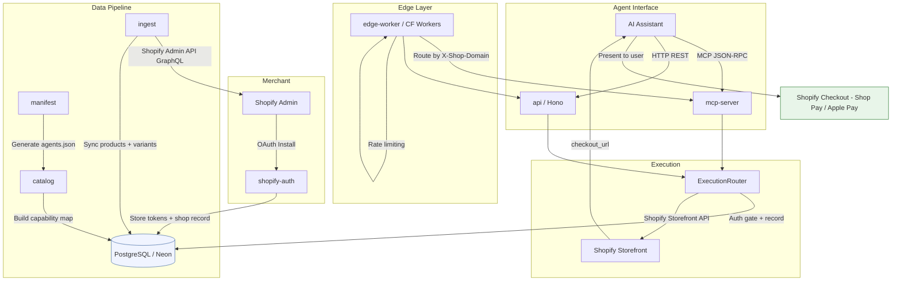

# Architecture Overview

## System Overview

Shopify Agent Channel is a multi-tenant SaaS platform that makes Shopify stores agent-compatible. Merchants install the app via OAuth, and the system syncs their product catalog, exposes it through dual interfaces (MCP and HTTP REST), and enables AI assistants to search products, build carts, and initiate checkout — all backed by Shopify's native checkout (Shop Pay / Apple Pay). Each merchant's store becomes a new AI-powered sales channel with zero ad spend.

---

## Data Flow

1. **OAuth Install** — Merchant installs the app via Shopify OAuth. Access tokens are encrypted (AES-256-GCM) and stored in PostgreSQL.
2. **Product Ingest** — The ingest pipeline pulls products and variants from Shopify Admin API (GraphQL) into the local database.
3. **Catalog Indexing** — The catalog package builds a capability map from ingested products, defining searchable fields and tool definitions.
4. **Manifest Generation** — The manifest package produces an `agents.json` descriptor advertising the shop's available tools and capabilities.
5. **Agent Request** — An AI assistant calls the shop's endpoint via MCP (Streamable HTTP, JSON-RPC) or HTTP REST.
6. **Execution Router** — The request hits the ExecutionRouter, which enforces auth gating, delegates to the Shopify adapter, and records the tool run.
7. **Shopify Storefront API** — Cart creation and checkout initiation call Shopify's Storefront API (GraphQL).
8. **Checkout URL Returned** — The agent receives a `checkout_url` pointing to Shopify's native checkout. The user completes payment via Shop Pay or Apple Pay.

---

## System Diagram

---

## Multi-Tenancy

- **Tenant = Shop.** Every Shopify store that installs the app is an isolated tenant.
- **Routing.** The edge worker resolves the target shop via the `X-Shop-Domain` header on every inbound request.
- **Data isolation.** All database queries are scoped to the resolved `shop_id`. No cross-tenant data leakage is possible at the query layer.
- **Rate limiting.** Limits are enforced per tenant (per-IP for reads, per-token-hash for writes) at the edge worker before requests reach the execution layer.

---

## Package Structure

| Package | Role |
|---------|------|
| `packages/db` | Drizzle ORM schema and migrations for PostgreSQL/Neon. Tables: `shops`, `products`, `manifests`, `tool_runs`, `success_scores`. |
| `packages/shopify-auth` | OAuth install flow, HMAC webhook verification, and token encryption (AES-256-GCM). |
| `packages/ingest` | Syncs products and variants from Shopify Admin API (GraphQL) into the local database. |
| `packages/catalog` | Capability map builder, tool definitions, and product search/detail logic. |
| `packages/manifest` | Generates `agents.json` manifest files describing a shop's available tools and capabilities. |
| `packages/exec` | ExecutionRouter: auth gating, adapter delegation (Shopify Storefront API), and tool run recording. |
| `packages/mcp-server` | MCP server using the TypeScript MCP SDK. Registers 4 tools: `search_products`, `get_product`, `create_cart`, `initiate_checkout`. |
| `packages/api` | Hono HTTP API with routes for product search, product detail, cart, checkout, admin, and auth. |
| `packages/edge-worker` | Cloudflare Workers entry point. Resolves shop from headers, applies rate limits, delegates to API and MCP handlers. |
| `packages/reliability` | Success score computation per tool (success_rate, p50/p95 latency, failure modes) and nightly reverification job. |
| `packages/shared` | Types-only re-export barrel for cross-package type sharing. |

---

## Dual Interface

Both MCP and HTTP interfaces expose the same four tools and are backed by the same `ExecutionRouter`:

| Interface | Transport | Protocol | Use Case |
|-----------|-----------|----------|----------|
| **MCP** | Streamable HTTP (SSE) | JSON-RPC 2.0 | AI agents using the Model Context Protocol |
| **HTTP REST** | Standard HTTP | JSON request/response | Any HTTP client, simpler integrations |

The `ExecutionRouter` is the single point of control for auth enforcement, adapter delegation, and tool run recording. Neither interface contains execution logic — they are thin transport layers.

---

## Security and Threat Model

### Token Encryption at Rest

- Shopify access tokens are encrypted with AES-256-GCM before storage.
- The encryption key is provided via the `ENCRYPTION_KEY` environment variable and never committed to source.
- Tokens are decrypted only at the moment of use (Shopify API calls) and never held in plaintext longer than necessary.

### Webhook Verification

- All Shopify webhooks are signed with HMAC-SHA256.
- The `shopify-auth` package verifies the HMAC signature against the app's client secret before processing any webhook payload.
- Requests with invalid or missing signatures are rejected with 401.

### Auth Gating

| Tool | Auth Required | Rationale |
|------|--------------|-----------|
| `search_products` | No (rate-limited) | Read-only, public catalog data |
| `get_product` | No (rate-limited) | Read-only, public catalog data |
| `create_cart` | Yes (Bearer token) | Write operation, creates server-side state |
| `initiate_checkout` | Yes (Bearer token) | Write operation, generates checkout URL |

### Rate Limiting

| Scope | Limit | Key |
|-------|-------|-----|
| Read endpoints (search, get_product) | 120 requests/min | Per IP address |
| Write endpoints (create_cart, checkout) | 30 requests/min | Per token hash |
| Admin endpoints | 10 requests/min | Per IP address |

Rate limits are enforced at the edge worker layer before requests reach the execution router.

### No Payment Processing

- The system never processes payments directly.
- `initiate_checkout` returns a `checkout_url` that points to Shopify's native checkout.
- The user completes payment through Shopify (Shop Pay / Apple Pay) with all of Shopify's built-in fraud protection.

### Input Validation

- All query parameters and JSON request bodies are validated at system boundaries.
- Schema validation (Zod-style) rejects malformed input before it reaches business logic.
- GraphQL queries to Shopify APIs use parameterized variables, preventing injection.

### Data Exposure Controls

- Access tokens are never included in API responses or tool outputs.
- Agent-facing responses contain only catalog data, cart summaries, and checkout URLs.
- Error messages do not leak internal state or stack traces in production.

### CORS

- CORS is open for v1 to support broad agent integration.
- This will be revisited for production hardening with an allowlist approach.

---

## Reliability

### Success Scores

The reliability package computes per-tool success scores for each shop:

- **success_rate** — Percentage of tool runs that completed without error.
- **p50 latency** — Median response time across recent tool runs.
- **p95 latency** — 95th percentile response time, surfacing tail latency issues.
- **failure_modes** — Categorized breakdown of failure reasons (timeout, auth error, Shopify API error, etc.).

Scores are stored in the `success_scores` table and queryable via admin endpoints.

### Nightly Reverification

A scheduled job runs nightly and executes all 4 tools against every active shop:

1. `search_products` with a generic query
2. `get_product` for a known product ID
3. `create_cart` with a valid line item
4. `initiate_checkout` for the created cart

Results update the shop's success scores. **Shops scoring below 80% are flagged** for investigation, indicating potential regressions in the merchant's Shopify configuration or the adapter layer.
